# Part 2: Client VM Setup, Domain Join & GPO Enforcement

This section covers the deployment and configuration of two Windows 10 client machines that connect to the internal network, join the domain anthonytech.com, and are managed via group policies. You will:

- Set up Windows 10 VMs in VirtualBox
- Join both clients to the domain
- Log in with created domain users (Helpdesk and Bruce Wayne)
- Install RSAT tools on the Helpdesk machine
- Create and apply a GPO that disables Task Manager for User (Bruce Wayne)

## Step 1: Create and Configure Windows 10 VMs

Each Windows 10 VM should be created in VirtualBox and configured as follows:

- Adapter 1: Internal Network (same name as used by the server, e.g., intnet)

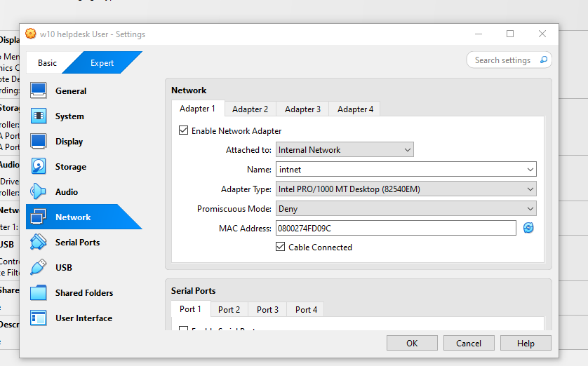

## Step 2: Domain Join (Desktop1) - Helpdesk User 

1. Go to System Properties > Computer Name

2. Rename the PC to Desktop1

3. Click "Change" and join the domain: anthonytech.com

4. When prompted, enter credentials for a domain admin account

5. Reboot when prompted

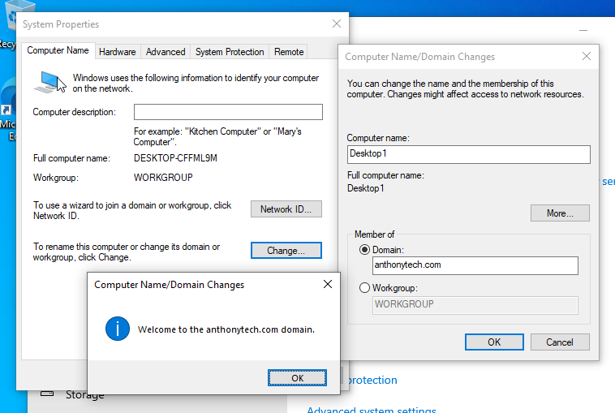

## Step 3: Log in with Domain User (Helpdesk)

1. After rebooting Desktop1, log in using the domain credentials:

- Username: helpdesk

- Domain: anthonytech.com

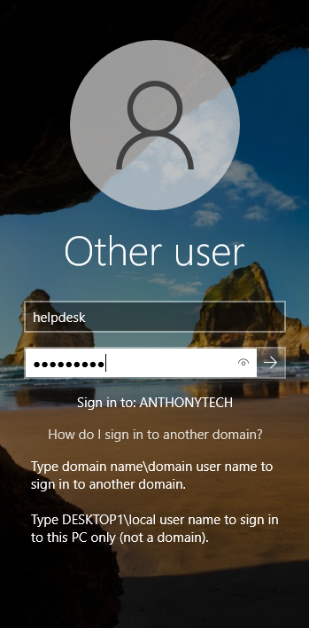

## Step 4: Confirm IP and DNS Configuration

1. Open Command Prompt and run ipconfig /all

2. Verify:

- IP is from DHCP (192.168.0.x)

- DNS points to server (192.168.0.1)

- Domain suffix is anthonytech.com

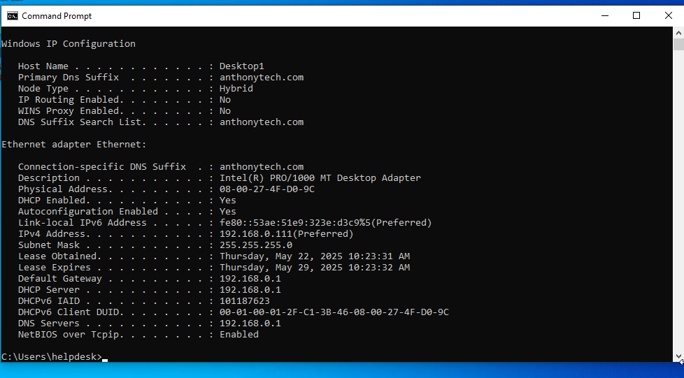

## Step 5: Install RSAT Tools (Helpdesk User Only)

1. On Desktop1 (logged in as Helpdesk), open "Optional Features"

2. Install the following RSAT tools:

- Active Directory Domain Services

- DNS

- DHCP

- Group Policy Management

- Remote Access

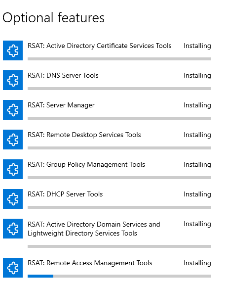

3. After installation, verify the tools appear under "Windows Administrative Tools"

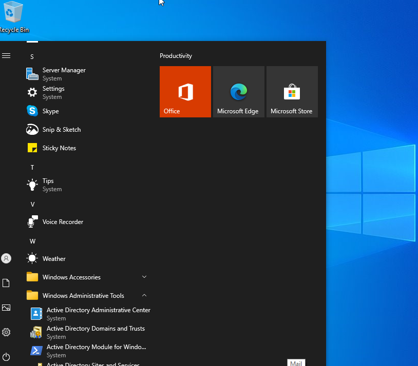

## Step 6: Setup Desktop2 and Bruce Wayne

1. Create another Windows 10 VM

2. Join it to the domain as Desktop2

3. Log in using the bwayne domain user

4. Confirm IP address and DNS using ipconfig /all

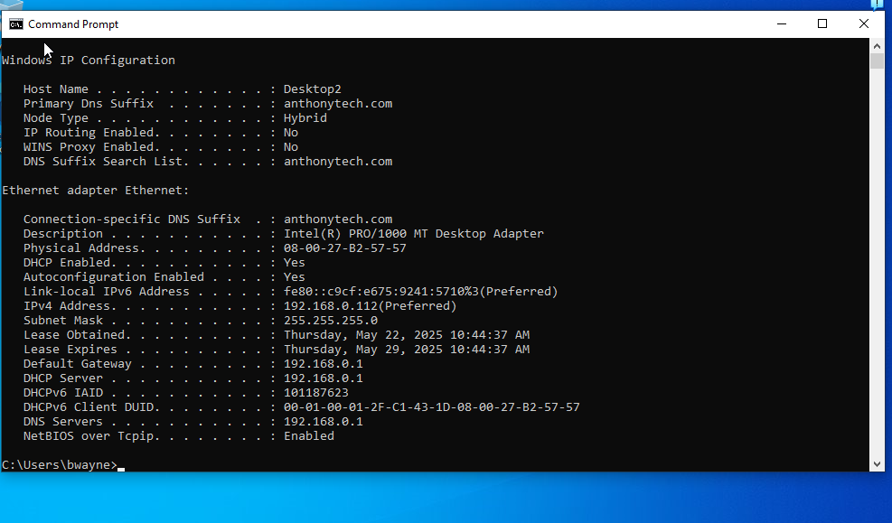

The image below shows that the computer has connected to the DHCP server and shows that it has been given an IP Address

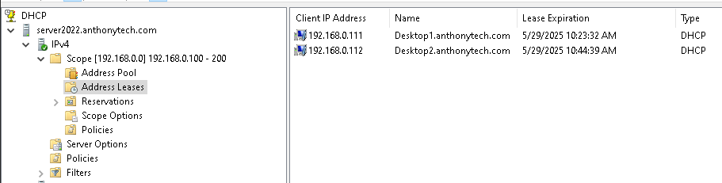

The image below shows that the computer has connected to the domain controller -> anthonytech.com

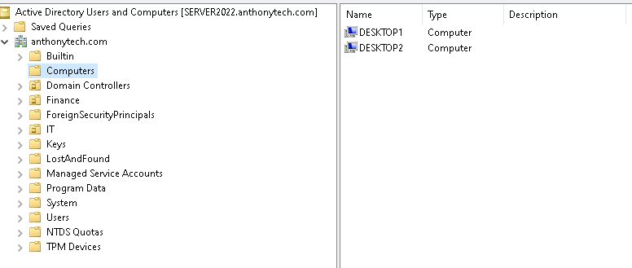

## Step 7: Apply Password Policies via GPO

1. Open Group Policy Management on the server

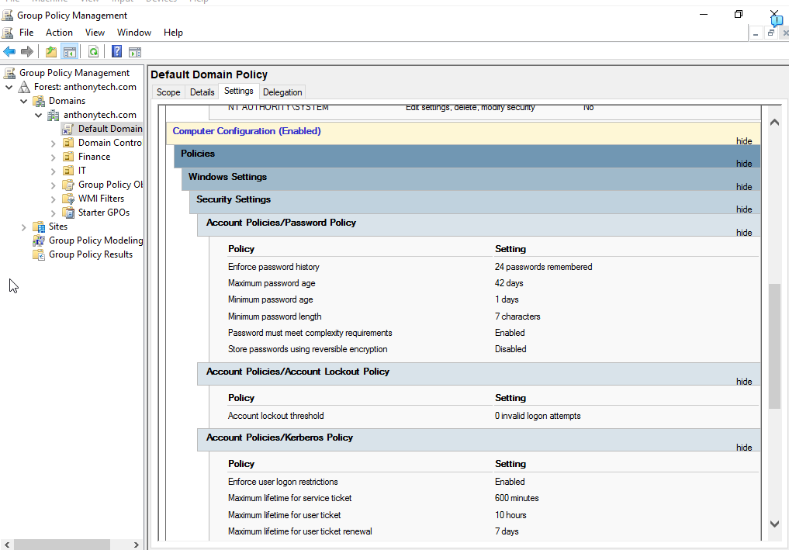

The image above are the original settings that were configured for the password policies which is not good enough wtih settings: 

- Max password age: 42 days
- Lockout threshold: none
- Lockout duration: none

We have to change this

2. Edit Default Domain Policy

3. Under:

   - Computer Configuration > Policies > Windows Settings > Security Settings > Account Policies

The image below I am adjusting the password policies 

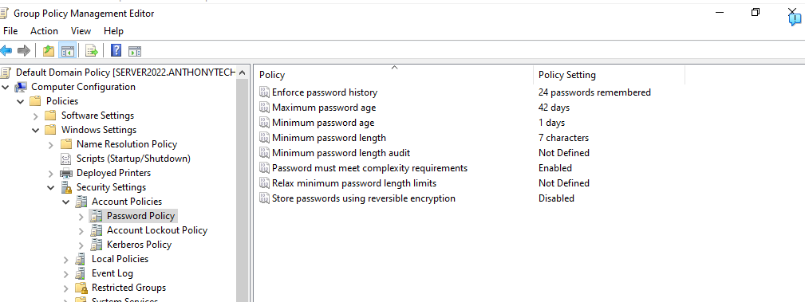

The image below I am adjusting the account lockout settings 

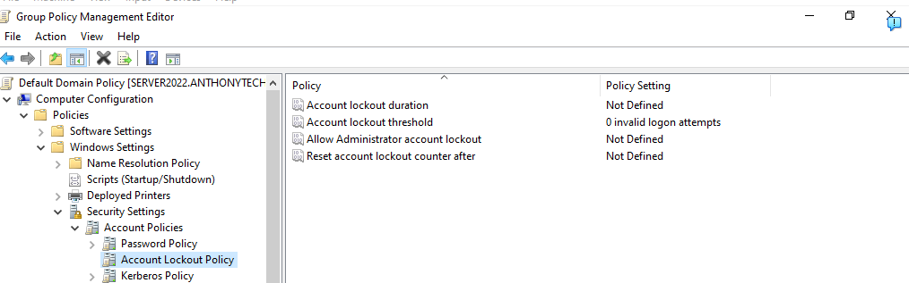

4. Set:

- Min password length: 7 characters

- Max password age: 90 days

- Lockout threshold: 3 attempts

- Lockout duration: 10 minutes

Image Below confirms changes 

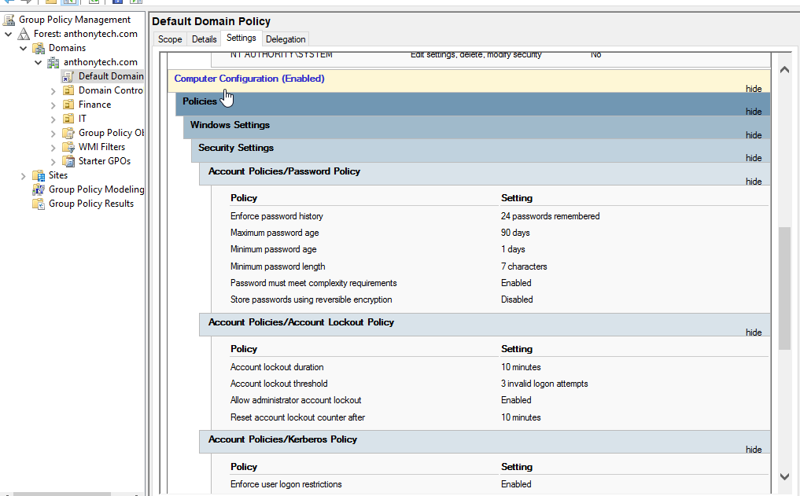

## Step 8: Disable Task Manager for User (Bruce Wayne Only) only to demonstrate what else GPO can do 

1. Create a new GPO named Task Manager

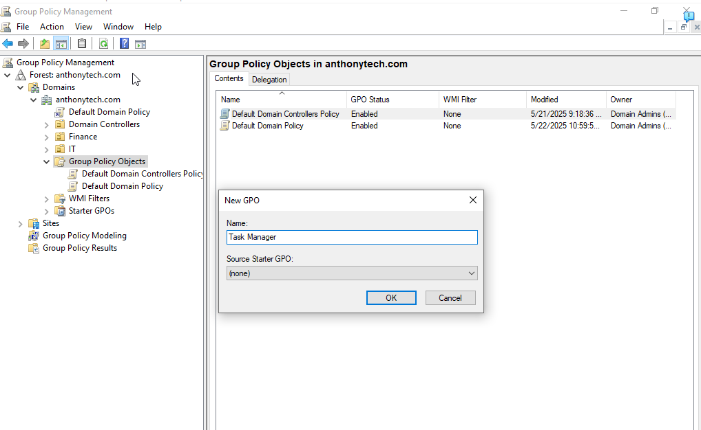

2. Link GPO to the domain, but filter it to only Bruce Wayne

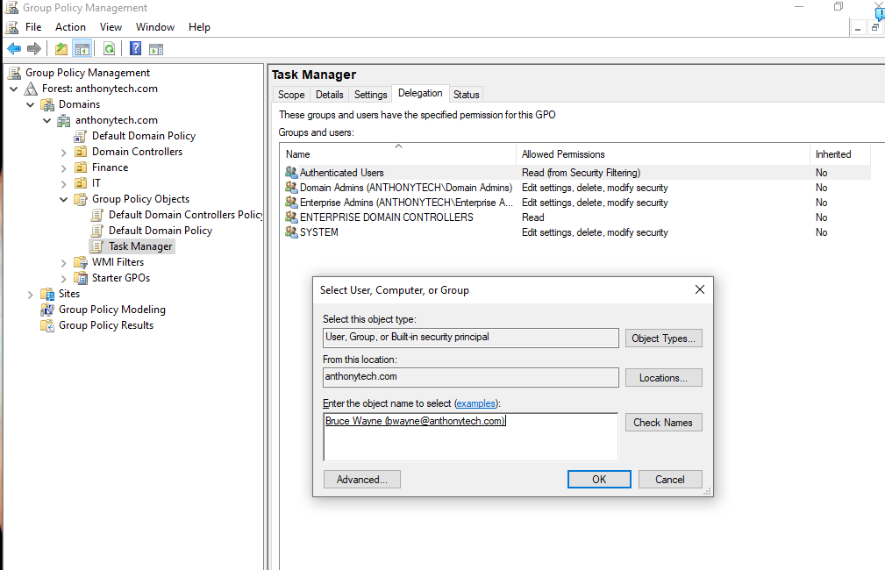

3. Under User Configuration > Policies > System > Ctrl+Alt+Del Options

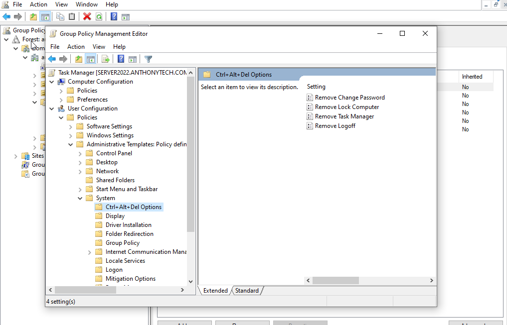

4. Enable: Remove Task Manager

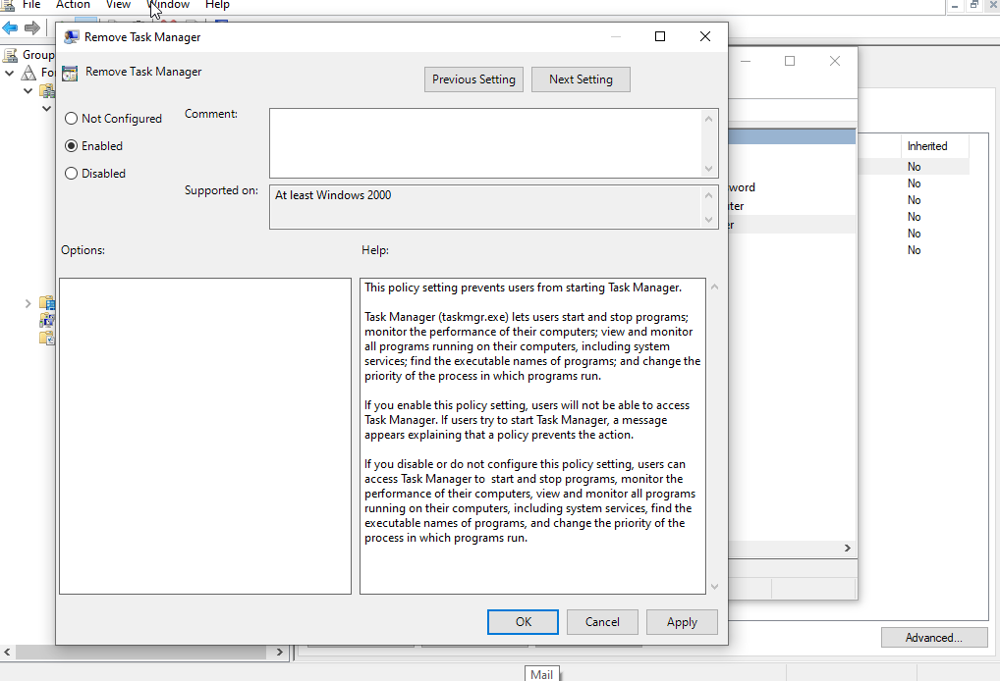

## Step 9:  Verify GPO Effectiveness

1. Log in as Bruce Wayne on Desktop2

2. Right-click taskbar — verify "Task Manager" is grayed out or blocked

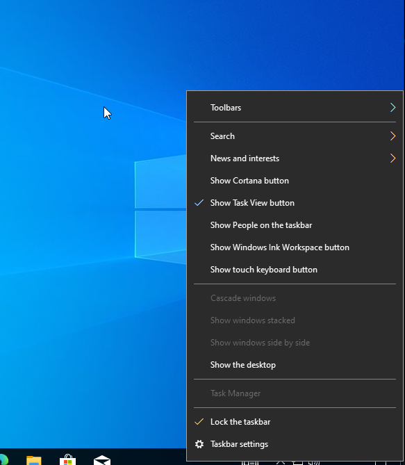

## To conclude Part 2: 

In this part of the lab project, we successfully:

- Set up two Windows 10 virtual machines for internal network use

- Joined both machines to the Active Directory domain

- Verified DHCP functionality and IP allocation

- Installed RSAT tools on the Helpdesk account to enable remote administrative access

- Created a Group Policy Object (GPO) to enforce organizational policies

- Targeted and tested the GPO by restricting Task Manager access for Bruce Wayne

This part established the practical connection between client workstations and centralized domain services, laying the foundation for secure administrative management in a simulated enterprise environment.

If you want to go back to Part 1 : ### 🔗 [← Go to Part 1: Windows Server 2022 Setup](https://github.com/anthonydiazz/Server2022)

